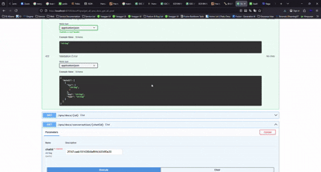

# ⚡ Document Extraction RAG — Fullstack (Frontend + Backend)

Project ini adalah fullstack system yang terdiri dari:

- **Frontend**: React + Vite + Tailwind CSS
- **Backend**: FastAPI + Postgresql + Redis + Vector DB (Chroma)

Dibuat untuk membangun aplikasi modern yang butuh kemampuan RAG (Retrieval Augmented Generation).

---




# 🎨 Frontend — React + Vite + Tailwind

Frontend ini dibangun menggunakan stack modern dengan fokus pada kecepatan dan kemudahan development.

## 🧠 Tech Stack

- ⚛️ **React 18+**
- ⚡ **Vite**
- 🎨 **Tailwind CSS**

---

## ⚙️ Installation & Setup (Frontend)

### 1️⃣ Clone Repository

```bash
git clone <git-src>
cd document-extraction-rag
git checkout fe-app
```

### 2️⃣ Install Dependencies

```bash
npm install
# atau
yarn install
# atau
pnpm install
```

### 3️⃣ Jalankan Development Server

```bash
npm run dev
# atau
yarn dev
```

# 🚀 Backend — FastAPI + MongoDB

Backend ini adalah RESTful API yang dirancang cepat, async, dan siap produksi.

## 🧠 Tech Stack

- 🐍 **Python 3.10+**
- ⚡ **FastAPI**
- 🐘 **PostgreSQL**
- 🔁 **SQLAlchemy**
- 🧩 **Pydantic**
- 🌱 **Uvicorn**
- 🎨 **ChromaDb**
- 🗃️ **Redis**
- 🔐 **python-dotenv**

## ⚙️ Installation & Setup (Backend)

## 1️⃣ Clone Repository

```bash
git clone <git-src>
cd document-extraction-rag
git checkout be-svc
```

## 2️⃣ Buat Virtual Environment

```bash
python -m venv venv
source venv/bin/activate       # Mac / Linux
venv\Scripts\activate          # Windows
```

## 3️⃣ Install Dependencies

```bash
pip install -r requirements.txt
```

## 4️⃣ Setup Environment

```bash
cp .env.example .env
```

## 🧾 .env.example

```bash
# API
LLM_API_KEY=
LLM_BASE_URL=
EMBEDDING_BASE_URL=

# DB
VECTOR_DB=          # chroma or faiss

# AI
MODEL_NAME=
EMBEDING_MODEL=
EMBEDDING_SIZE=

ACTIVE_ROUTERS={}

# Deployment
PROJECT_SERVICE_PORT=
SVC_MANAGEMENT_NAME=
REGISTRY=
PROJECT_NAME=
SERVER_SERVICE=
SERVER_DEPLOY_USER=
SERVER_DEPLOY_PASS=

BASE_POSTGRESQL_URL=
POSTGRESQL_TABLE_DOCUMENT=
```

## ▶️ Jalankan Server

```bash
uvicorn main:app --reload
```

## ▶️ Alternatif Jalankan Server

```bash
python main.py
```

## 🧠 API Documentation

FastAPI menyediakan dokumentasi otomatis:

- Swagger UI → http://localhost:8000/docs
- Atau → http://localhost:{SERVICE_PORT}/docs
